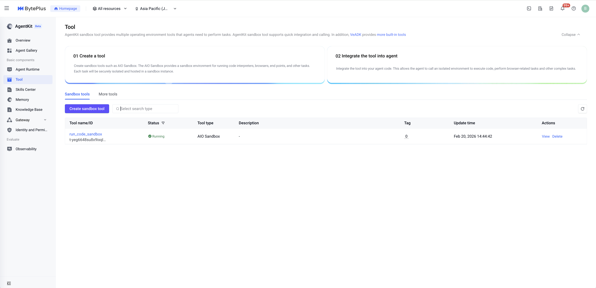
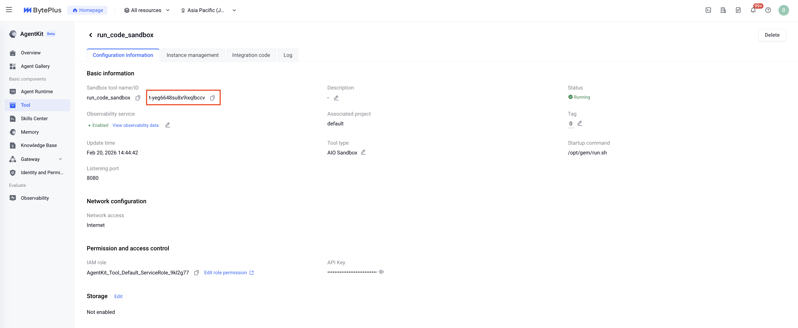

# Session 1 - Agent with the Sandbox Tool

## Overview

This sample demonstrates an agent that integrates a code execution sandbox. The agent can write and execute Python code (inside the sandbox) to solve tasks such as math problems, simulations, and logic puzzles.

## Key Features

1. **Sandbox integration**: Uses a secure sandbox environment to dynamically generate and execute Python code.
2. **Complex computation**: Leverages Python to handle calculations and logic that are cumbersome in pure natural language (e.g., Monte Carlo simulation).
3. **AgentKit compatible**: Follows the AgentKit runtime protocol, supporting cloud deployment and streaming interaction.

## What the Agent Can Do

- **Execute code**: Runs Python code through the `run_code` tool in a sandbox.
- **Dynamic problem solving**: Writes small algorithms for tasks like Monte Carlo estimation.
- **Return results**: Uses the execution output (stdout/stderr) to produce a final answer.

## Project Structure

```bash
sandbox_tool_sample/
├── agent.py          # Agent server entry; integrates the run_code tool
├── client.py         # Local test client (SSE streaming)
├── .env.example      # Example env file (tool id)
├── README.md         # Chinese README
└── README_EN.md      # English README (this file)
```

## Run Locally

## BytePlus Notes (Important)

This sample uses VeADK’s `run_code` tool, which calls the AgentKit Sandbox tool via the AgentKit OpenAPI endpoint. By default, VeADK assumes the Volcano Engine endpoint in `cn-beijing`. For BytePlus, you must override the AgentKit tool endpoint and region via environment variables.

### 1) Prerequisites

Create a Sandbox tool in the AgentKit console and copy the tool ID:

1. Open the Sandbox page in AgentKit

   

2. Create a Sandbox tool

   

3. Copy the tool ID

   

### 2) Install dependencies and configure environment variables

```bash
uv sync
source .venv/bin/activate

cp .env.example .env
```

Edit `.env` and set at least:

- `AGENTKIT_TOOL_ID`: the Sandbox tool ID you created
- `AGENTKIT_TOOL_REGION`: `ap-southeast-1`
- `AGENTKIT_TOOL_HOST`: your BytePlus AgentKit endpoint, e.g. `agentkit.ap-southeast-1.bytepluses.com`
- `MODEL_AGENT_API_KEY`: your ModelArk API key
- `MODEL_AGENT_API_BASE`: `https://ark.ap-southeast.bytepluses.com/api/v3`

Credentials (AK/SK):

- This sample reads `VOLCENGINE_ACCESS_KEY` / `VOLCENGINE_SECRET_KEY` for request signing.
- For BytePlus, you can keep these env var names, but set them to your BytePlus AK/SK values.

Example:

```bash
export VOLCENGINE_ACCESS_KEY=<your_byteplus_ak>
export VOLCENGINE_SECRET_KEY=<your_byteplus_sk>
```

### 3) Start the agent server

```bash
uv run agent.py
```

The server listens on `http://127.0.0.1:8000` by default.

### 4) Run the local client

In a new terminal:

```bash
uv run client.py
```

`client.py` sends a prompt to the agent and prints streaming events.

## Deploy with AgentKit

### 1) Initialize configuration

```bash
agentkit config
```

This interactive command guides you through generating the deployment configuration.

### 2) Deploy

```bash
agentkit launch
```

### 3) Invoke the cloud agent

```bash
agentkit invoke "Estimate PI using Monte Carlo simulation"
```

## Example Prompts

- "Estimate PI using Monte Carlo simulation"
- "Compute the 100th Fibonacci number with Python"
- "Generate 10 random numbers and sort them"

## Troubleshooting

- **Code execution fails**
  - Verify `AGENTKIT_TOOL_ID` is correct and the network is reachable.
- **Which libraries are available in the sandbox?**
  - By default, only the Python standard library is guaranteed.

## License

Apache 2.0