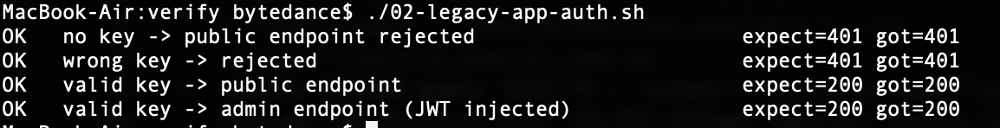
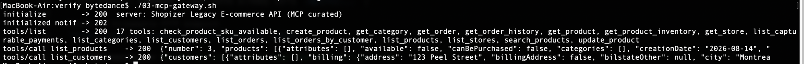
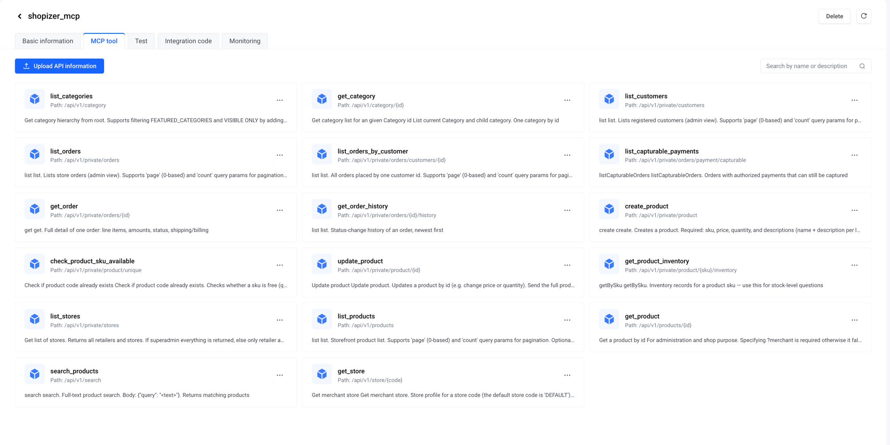
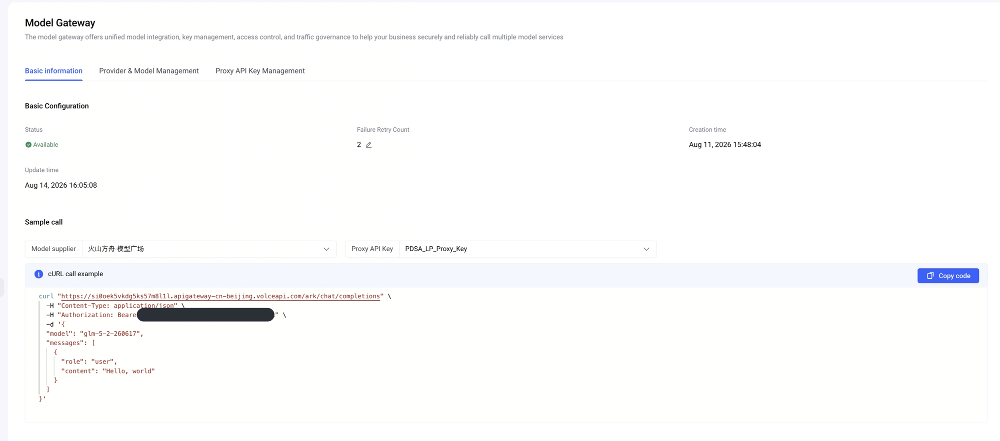
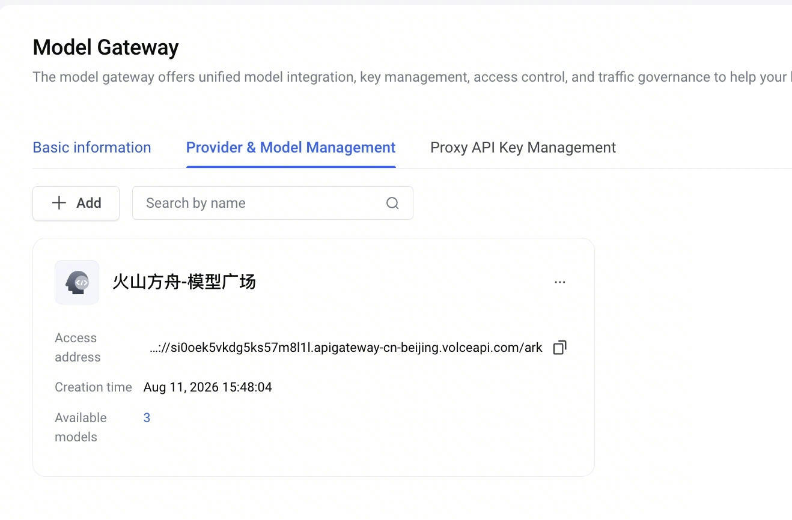
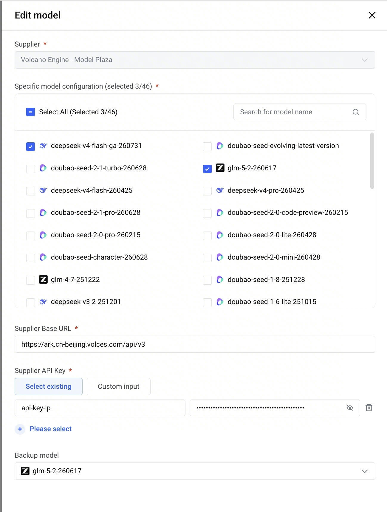

# 课后作业提交 — Legacy E-commerce Backend × AgentKit Gateway

> **One-liner:** We took a real open-source legacy e-commerce backend (Shopizer),
> put it behind an API-key gate, converted its Swagger into MCP tools via the
> **MCP Gateway**, proxied its LLM traffic through the **Model Gateway** (with a
> backup model configured), and deployed a **Shop Ops Copilot** agent on AgentKit
> Runtime that answers catalog / inventory / customer questions — and can even
> create products — entirely through the two gateways.
>
> All code, specs, configs and verify scripts live in this directory; the
> engineering README (reproduce steps, gotchas) is [README.md](README.md).
> This document is the homework walkthrough, structured for screenshots + the
> demo video.

## Rubric checklist

| # | Rubric item | Level | Status | Where shown |
|---|---|---|---|---|
| 1 | Legacy app with industry attributes | 基础 | ✅ | §1 |
| 1+ | App protected by API-Key auth | 进阶 | ✅ | §1.3 |
| 2 | Swagger/OpenAPI extraction | 基础 | ✅ | §2 |
| 2+ | Auto-generate by scanning code | 进阶 | ◻︎ covered by sibling submission | — |
| 3 | Agent connects via Model Gateway endpoint | 基础 | ✅ | §4, §5 |
| 3+ | Break primary model → fallback to backup | 进阶 | ✅ configured — live break N/A (shared supplier key, §7) | §4, §7 |
| 4 | Credential hosting + MCP outbound credentials | 进阶 | ✅ | §3.3, §6 |

---

## 1. The legacy application — Shopizer

### 1.1 What it is and why we chose it

**Shopizer** (https://github.com/shopizer-ecommerce/shopizer) is a mature,
open-source **e-commerce backend** — the kind of system a retailer genuinely has
running in production:

- **Industry attributes (零售/电商):** product catalog, categories, inventory,
  pricing, customers, orders, stores, manufacturers.
- **Real legacy traits, not a toy:** Java 8 / Spring Boot monolith, **Swagger 2.0**
  (Springfox), JWT-based admin auth, an H2 database, and a **huge API surface —
  244 paths** in the raw spec, which is exactly why a gateway (with curation) is
  the right tool instead of hand-wiring tools.
- It ships an official Docker image, so "the legacy app" runs as a container on a
  cloud VM — a realistic stand-in for an on-prem system that we are not allowed
  (or willing) to modify.

### 1.2 Where it runs and what data we seeded

- A ECS VM (public IP) runs the container on `127.0.0.1:8081`; an **nginx
  reverse proxy on :8080** is the only public entry point, fronted by the DNS
  name `shopizer-api.wind.cloudpeek.xyz`.
- Seeded demo data (via the admin API, persisted into the container image
  `shopizer-seeded:1.0`):
  - **4 products** — Walnut Dining Table (`table1`, $899 ×25), Leather Office
    Chair (`chair1`, $459 ×40), Oak Dining Chair (`chair2`, $199 ×120),
    Standing Desk Chair (`chair3`, $349 ×60)
  - **2 categories** — Tables, Chairs
  - **3 customers** — including Jane (id 200) in Toronto
  - **0 orders** — a fresh store; the agent honestly reports "no orders yet"
    instead of hallucinating sales (a good demo moment)
  - plus **1 product created live by the agent** during testing
    (`table2`, "Walnut Coffee Table", id 100) — proof the write path works.

### 1.3 进阶 — API-Key auth in front of the legacy app

Shopizer's own admin API uses a JWT obtained by logging in with the admin
username/password — fine for humans, wrong shape for a gateway credential. We put
an **nginx API-key gate** in front of it (`gateway/nginx-shopizer-gw.conf`):

```
MCP Gateway ──X-API-Key──▶ nginx :8080 ──Authorization: Bearer <admin JWT>──▶ Shopizer :8081
                             │ 401 if key missing/wrong
                             └ daily cron refreshes the 7-day JWT
```

- Every request must carry the static `X-API-Key`; nginx validates it, then
  **injects the real Shopizer admin JWT** before proxying.
- The JWT never leaves the VM; a cron job (`gateway/shopizer-jwt-refresh.sh`)
  re-logs-in and reloads nginx daily (Shopizer JWTs expire in 7 days).
- Why not put the JWT directly in the gateway? The outbound-credential value
  charset is restricted to `[A-Za-z0-9!@#$%_-]` — a JWT (dots) or a `Bearer `
  prefix (space) is rejected by the console. The static key + edge injection
  pattern is the clean answer.



---

## 2. Swagger extraction (基础)

1. Pulled the **live Swagger 2.0** from the running app: `GET /v2/api-docs`
   (244 paths — saved as `swagger/shopizer-openapi.json`).
2. Converted Swagger 2.0 → OpenAPI 3.
3. **Curated to 17 operations** an ops copilot actually needs — catalog reads,
   inventory, customers, orders, store info, plus a small write set
   (`create_product`, `check_product_sku_available`) — via
   `swagger/transform_shopizer_spec.py`.
4. **Fully inlined every `$ref`** → `swagger/shopizer-gateway-flat.json`.
   This was the decisive step: the MCP Gateway importer rejects framework
   Swagger (`$ref`/`components`, multiple responses per op, `type: file`) with a
   generic `InvalidParameter.Config`. The flat variant imports cleanly.



---

## 3. MCP Gateway (console configuration)

Console → AgentKit → Gateway (网关) → MCP 服务.

### 3.1 Create the MCP service (Swagger → MCP)

| Field | Value |
|---|---|
| Import mode | API file / HTTP 转 MCP |
| API file | `swagger/shopizer-gateway-flat.json` |
| Backend protocol | `http` |
| Backend domain | `shopizer-api.wind.cloudpeek.xyz` |
| Backend port | `8080` |
| Path prefix | **none** — spec paths already carry `/api/v1/...` |

Result: a Streamable HTTP endpoint
`https://skh75hercjshfbrjpun6d.apigateway-cn-beijing.volceapi.com/mcp`.


The imported tools are also listed in the console (MCP tool tab) — all 17:



### 3.2 Inbound auth (callers → gateway)

| Field | Value |
|---|---|
| Auth mode | API-Key |
| Caller sends | `Authorization: Bearer <key>` |
| Key created | `apikey_56eaa2j` |

(Visible in the §3.1 screenshot above — "Inbound identity authentication".)

### 3.3 进阶 — Outbound credential (凭据托管)

| Field | Value |
|---|---|
| 加密方式 | **凭据托管（托管存储）** |
| API Key 名称 | `win-shopizer-api-key` |
| 参数位置 | `Header` |
| 参数名称 | `X-API-Key` |
| API Key 值 | the static key the nginx gate expects |
| Prefix | **empty** |

Every tool call from the gateway to the legacy app now carries `X-API-Key`;
nginx validates it and swaps in the admin JWT.

(Attached key visible in the §3.1 screenshot above — "Backend service" →
API Key `win-shopizer-api-key`.)

### 3.4 Verification

`verify/03-mcp-gateway.sh` — raw MCP handshake: `initialize` → `tools/list`
(17 tools) → `tools/call list_products` (public op) and `list_customers`
(admin op), both returning live data. (Output shown in the §2 figure above.)

---

## 4. Model Gateway (console configuration)

Console → AgentKit → Gateway (网关) → Model 网关.

| Field | Value |
|---|---|
| Supplier | Volcano Engine — Model Plaza (Ark) |
| Models | `deepseek-v4-flash-ga-260731` (primary) |
| **Backup model (进阶)** | `glm-5-2-260617` |
| Supplier Base URL | `https://ark.cn-beijing.volces.com/api/v3` |
| Supplier API Key | existing hosted Ark key |
| Caller auth | gateway **proxy key** (`sk-…`) — the real Ark key never leaves the gateway |

Agent-side config = exactly two values: `MODEL_GATEWAY_BASE_URL` (the gateway
endpoint) and `MODEL_GATEWAY_API_KEY` (the proxy key).







---

## 5. The Agent — Shop Ops Copilot (VeADK)

`agent/agent.py` — a VeADK agent, ~80 lines:

- **Model** via the Model Gateway (`model_api_base` / `model_api_key` = gateway
  endpoint + proxy key). The agent pins exactly **one** model id
  (`deepseek-v4-flash-ga-260731`) — fallback must happen gateway-side.
- **Tools**: a `TrustedMcpToolset` pointed at the MCP Gateway URL + inbound key.
  All 17 Shopizer operations appear as native agent tools.
- Persona: an **ops/admin copilot** — answers catalog, inventory, customer and
  order questions, checks before writing, reports empty data honestly.

(No local-run screenshot — the live demo is shown straight from the deployed
runtime in §6/§8.)

---

## 6. Deploy to AgentKit Runtime + online test (基础 chain, end to end)

Deployed with the `agentkit` CLI (cloud build, one command):

```
agentkit deploy   →   runtime shop-ops-copilot (r-yestkjd8n465mv4cfw72)
                      endpoint https://s09sv0r2b0dt5iidg4ftp.apigateway-cn-beijing.volceapi.com
```

A cloud-side `agentkit invoke` returned the correct catalog answer via real MCP
tool calls from the runtime — proving the full chain
**user → runtime → Model Gateway + MCP Gateway → nginx gate → Shopizer**
works from the managed environment, not just a laptop.


**▶️ Demo video:** [agentkit-shop-ops-demo.mp4](screenshots/agentkit-shop-ops-demo.mp4)
— recorded in the runtime's **Online test** UI: the prompts from §8, the
tool-call trace against the MCP Gateway, and the grounded answers.
(For true inline playback on GitHub, drag the mp4 into any issue/comment box
and replace this link with the generated `user-attachments` URL.)

---

## 7. 进阶 — Fallback demo (break the primary model)

Backup model `glm-5-2-260617` is configured on the gateway for primary
`deepseek-v4-flash-ga-260731` (screenshot in §4 — "Backup model" field).

**Why no live break-the-primary demo here:** both models sit under a *single*
supplier integration (Ark Model Plaza) with **one shared Supplier API Key and
one shared Base URL** — and the plaza UI makes models checkboxes, so we can't
point the primary at an invalid model id either. Any fault we could inject
(invalid key, invalid URL) would take down the backup together with the
primary. A live failover demo would require hosting the backup under a
**second supplier entry** with its own credential.

**How a real failover would be observed** (no config change on the agent — same
endpoint, same proxy key, same requested model id; resilience is a gateway
property, not app code):

1. `verify/01-model-gateway.sh` prints the response JSON's `model` field —
   `deepseek-v4-flash-ga-260731…` when the primary serves,
   `glm-5-2-260617…` once the backup takes over.
2. The gateway's logs/metrics show failed primary calls and traffic shifting to
   the backup.

---

## 8. Demo video script — online test UI prompts

Run in this order; each beat has a talking point.

| # | Prompt (paste into online test) | What to say / point out |
|---|---|---|
| 1 | `What products do we sell? Show prices and stock in a table, and tell me which store this is.` | Agent calls `list_products` / inventory tools via the **MCP Gateway**; answer is grounded in the legacy DB, incl. store name + currency. |
| 2 | `Which products are low on stock (under 50 units)?` | The agent reasons over the data it just pulled — a real ops question. |
| 3 | `Who are our registered customers and where are they located?` | Calls the **admin-protected** customer tool — only possible because the gateway attaches the hosted credential and nginx injects the JWT. |
| 4 | `Any orders yet? How did we do this week — order count and revenue?` | Store is fresh: the agent honestly reports **zero orders** instead of inventing revenue. Trust in grounded answers. |
| 5 | `Add a new product: "Oak Desk Lamp", sku lamp1, price 129.99, quantity 200. Check the sku is available first, then confirm it's in the catalog.` | **Write path**: `check_product_sku_available` → `create_product` → `get_product`. Then refresh — it's really in Shopizer. |
| 6 | `Summarize my store's health in 3 bullet points for tomorrow's ops meeting.` | Synthesis across everything above — the "copilot" payoff. |

---

## 9. Security

> The agent holds **only gateway credentials**: a Model Gateway proxy key and an
> MCP Gateway inbound key. The real Ark API key is hosted in the Model Gateway;
> the legacy app's key is hosted in the MCP Gateway's credential management
> (凭据托管) and attached as the outbound credential; and the actual Shopizer
> admin JWT never even leaves the VM — nginx swaps it in at the edge, refreshed
> daily by cron. Rotate any secret and the agent never notices. Least-privilege,
> centrally auditable, zero secrets in code — that is what "gateway" buys you
> over embedding keys in the agent.

---

## Appendix — repo artifacts

```
gateway_shopizer/
├── README.md                 ← engineering doc: reproduce steps, 7 gotchas
├── SUBMISSION.md             ← this file
├── agent/                    ← VeADK agent + .agentkit deploy config
├── swagger/                  ← raw 244-path spec → curated 17-op → flat (imported) spec
├── gateway/                  ← nginx gate conf, JWT refresh cron, MCP console steps
├── screenshots/              ← evidence images referenced from this document
└── verify/                   ← 01 model gateway, 02 API-key auth, 03 MCP handshake, ask_copilot.py
```
