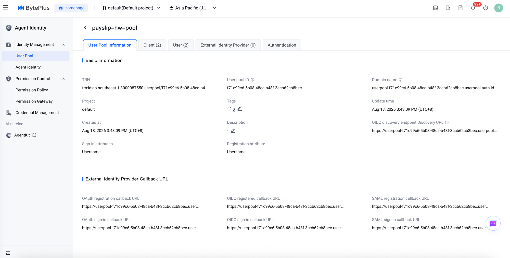
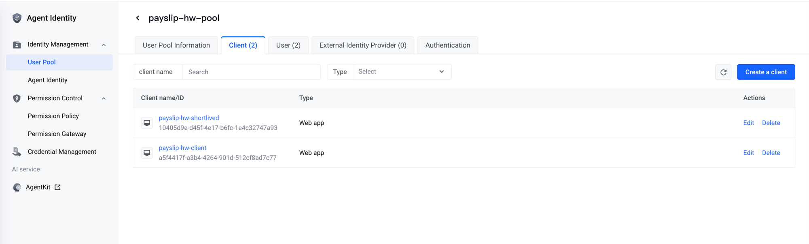
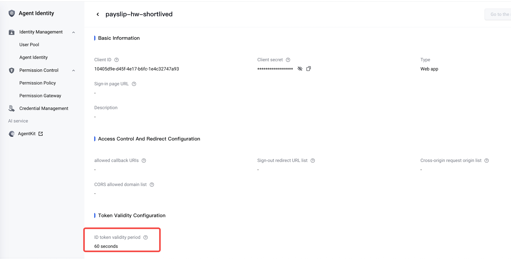
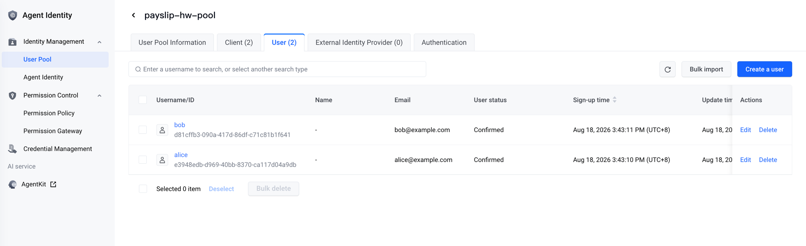
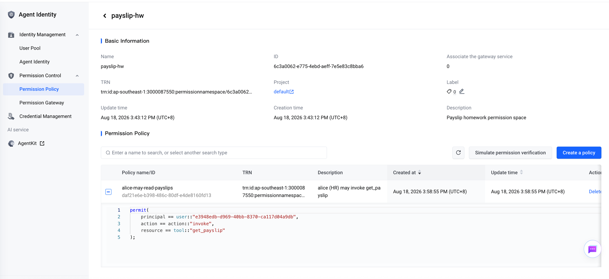
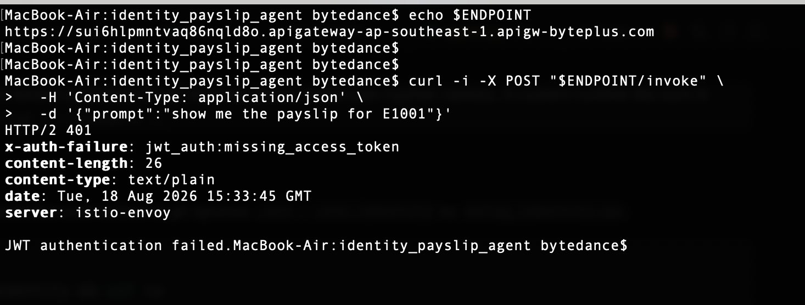
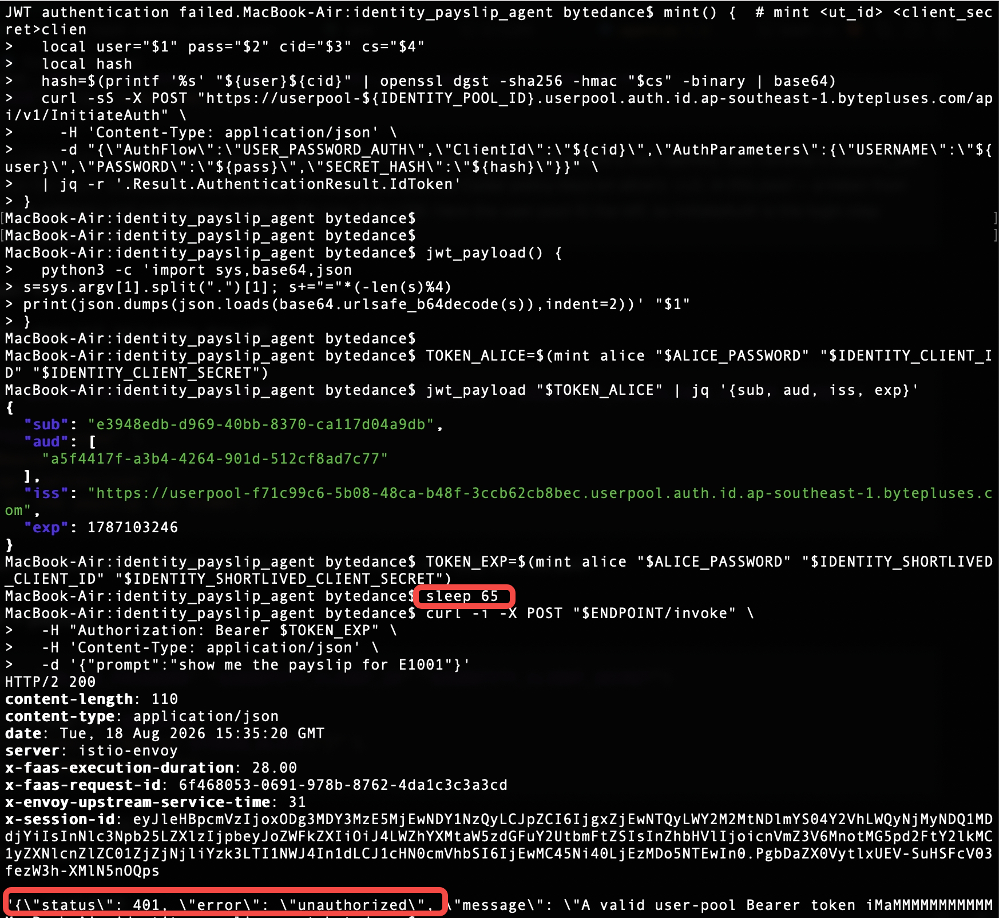
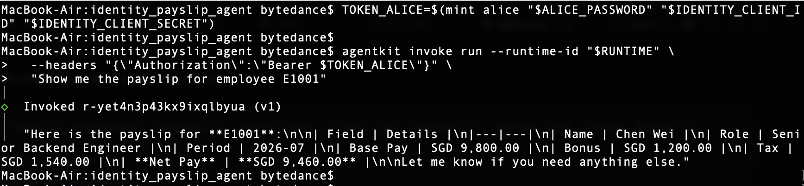
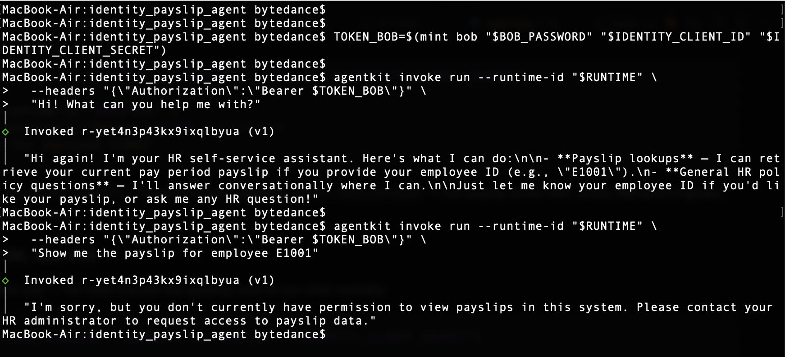

# Submission — Agent Identity & Policy Homework

**Scenario**: an HR self-service assistant with exactly **one tool**,
`get_payslip(employee_id)`. Employees log in through an Agent Identity **user
pool** and call the agent with their **id_token**; a **Cedar** permission
policy decides who may invoke the tool.

**Acceptance matrix** (the demo in Part C shows all four rows):

| # | Case | Mechanism | Result |
|---|------|-----------|--------|
| 1 | bare call, no token | inbound JWT authorizer | **401** |
| 2 | expired id_token | inbound JWT authorizer | **401** |
| 3 | alice (in Cedar policy) | CheckPermission → permit | **200 + payslip** |
| 4 | bob (valid user, not in policy) | CheckPermission → deny | chat OK, tool **403** |

Rows 1–2 come entirely from platform config (no agent code). Rows 3–4 are one
Cedar policy + one gated tool — demonstrating **authentication ≠
authorization**.

Deployed runtime (used throughout Part C):

- Runtime ID: `r-yet4n3p43kx9ixqlbyua` (`identity_payslip_agent-momi0yhe`)
- Endpoint: `https://sui6hlpmntvaq86nqld8o.apigateway-ap-southeast-1.apigw-byteplus.com`

---

## Part A — Agent Identity setup (console)

All of Part A lives in **BytePlus console → AgentKit → Agent Identity**.
(Everything below was actually provisioned by `setup_identity.py`; these are
the equivalent console steps for reproduction, with the exact same names so
the agent code works unchanged.)

### A1. Create the user pool

1. Agent Identity → **Identity Management → User Pool** → create a pool.
2. Name: `payslip-hw-pool`. Region: `ap-southeast-1`.
3. On the pool detail page (**User Pool Information** tab), save the **pool
   ID** (`f71c99c6-5b08-48ca-b48f-3ccb62cb8bec`) and note the **OIDC discovery
   endpoint**:
   `https://userpool-<pool-id>.userpool.auth.id.ap-southeast-1.bytepluses.com/.well-known/openid-configuration`
   — this is where the gateway's JWT authorizer gets the **JWKS** (public
   keys) to verify id_tokens locally.



### A2. Create two app clients

Inside the pool → **Client** tab → create two **Web app** clients:

1. `payslip-hw-client` — the normal client (default id_token TTL).
2. `payslip-hw-shortlived` — then open the client's detail page and under
   **Token Validity Configuration → ID token validity period** set **60
   seconds**. This client exists purely so demo row 2 can show an *expired*
   token without waiting hours.





### A3. Create the two users

Inside the pool → **User** tab → create:

1. `alice` — set a password, state **Confirmed**.
2. `bob` — same.

alice represents "HR staff allowed to read payslips"; bob is any other
employee. (In a real enterprise the pool would federate the corporate IdP;
here the pool is the IdP.)



### A4. Create the permission namespace

Agent Identity → **Permission Control → Permission Policy** → create a
namespace: `payslip-hw`.



### A5. Create the Cedar policy

Inside namespace `payslip-hw` → create a policy (`alice-may-read-payslips`),
writing Cedar directly:

```
permit(
    principal == user::"<alice-sub>",
    action == action::"invoke",
    resource == tool::"get_payslip"
);
```

`<alice-sub>` is alice's user ID (visible on her user detail page; the JWT
`sub` claim equals the pool `uid` — verified during setup).

> ⚠️ **Dialect gotcha worth mentioning in the submission**: the docs example
> uses `Action::"invoke"` (capital A) — that matches what the console /
> Permission Gateway PEP sends. An agent calling the **CheckPermission API**
> directly sends `Type: "action"` (lowercase), and the PDP maps the request
> `Type` verbatim into the Cedar entity type — so the policy must be
> lowercase `action::`. We discovered this empirically: a wildcard
> `permit(principal, action, resource)` ALLOWed, then we isolated one
> constrained position at a time (`probe_permission.py`).


### A6. Verify the policy (PDP smoke check)

`setup_identity.py` ends by calling **CheckPermission** twice against the
live PDP:

```
alice → invoke tool:get_payslip → ALLOW   ✓ (she is in the policy)
bob   → invoke tool:get_payslip → DENY    ✓ (he is not)
```

📸 *Screenshot/recording: this terminal output.*

---

## Part B — the agent + deployment

### B1. Agent code (walk through in the recording)

`agent.py` — a VeADK agent (`deepseek-v4-pro-ga-260813` on ModelArk) with
exactly one tool. The interesting 20 lines:

1. The entrypoint extracts the caller from the Bearer id_token, verifying it
   itself against the pool JWKS (`via=jwks-self-verify`). No identity → 401.
   (Runtime logs show the custom_jwt gateway forwards the original
   `authorization` header to the container along with platform metadata like
   `x-forward-consumer`, so self-verification is the path that runs.)
2. `get_payslip` reads the caller's `sub` and calls **CheckPermission**:
   `principal=user::<sub>, action=action::"invoke",
   resource=tool::"get_payslip"` in namespace `payslip-hw`.
   - DENY → the tool returns a **403** JSON payload; the agent's instruction
     makes it explain "no permission, contact HR" instead of inventing data.
   - ALLOW → returns the (mock) payslip; the agent formats it.
3. CheckPermission **fails closed** — any PDP error becomes DENY.

### B2. Deploy with the inbound JWT authorizer

The inbound half is pure configuration in `agentkit.yaml`:

```yaml
launch_types:
  cloud:
    runtime_auth_type: custom_jwt
    runtime_jwt_discovery_url: https://userpool-<pool-id>…/.well-known/openid-configuration
    runtime_jwt_allowed_clients: [ <payslip-hw-client id>, <payslip-hw-shortlived id> ]
```

Deploy (hermetic wheels build — see README "Gotchas" 5–6):

```bash
uv run --no-sync python gen_deploy_config.py   # agentkit.yaml -> agentkit.local.yaml
set -a && source .env && set +a
~/.agentkit/agentkit launch --config-file agentkit.local.yaml   # build + deploy one-shot
# (answer "Yes" to "Continue without enabling services?" — mem0 is unused)
```

Result: runtime `r-yet4n3p43kx9ixqlbyua`, endpoint
`https://sui6hlpmntvaq86nqld8o.apigateway-ap-southeast-1.apigw-byteplus.com`.

📸 *Screenshot: the runtime in the AgentKit console — endpoint URL, and the
auth settings showing custom_jwt with the pool's discovery URL.*

---

## Part C — demo (the four rows), step by step with the agentkit CLI

Each row is one small step — record the terminal while running them in
order. Rows 3–4 use `agentkit invoke run`; rows 1–2 use plain `curl` /
a wait, because the CLI refuses to send a request without a token (which is
itself a nice demonstration of the gateway contract).

> `agentkit chat` is **not** used here: it only accepts tenant-published
> OAuth *Harness* aliases (lowercase-hyphen names). A custom runtime like
> ours is called with `agentkit invoke run --runtime-id … --headers …`.

### C0. Load the environment

All coordinates (pool ID, client IDs/secrets, user passwords) were written
to git-ignored `.env` / `.env.identity` by `setup_identity.py`:

```bash
cd use-cases/identity_payslip_agent
set -a && source .env && source .env.identity && set +a

ENDPOINT=https://sui6hlpmntvaq86nqld8o.apigateway-ap-southeast-1.apigw-byteplus.com
RUNTIME=r-yet4n3p43kx9ixqlbyua
```

### C1. Row 1 — no token → 401

```bash
curl -i -X POST "$ENDPOINT/invoke" \
  -H 'Content-Type: application/json' \
  -d '{"prompt":"show me the payslip for E1001"}'
```

Expected: **HTTP 401**, body `JWT authentication failed.` — the gateway
authorizer rejects the request before it ever reaches the agent. Pure
config, no code.



### C2. Mint id_tokens from the user pool (InitiateAuth)

This helper does the same login the demo users would do (USER_PASSWORD_AUTH
+ SECRET_HASH, exactly as in `identity_utils.py`):

```bash
mint() {  # mint <username> <password> <client_id> <client_secret>
  local user="$1" pass="$2" cid="$3" cs="$4"
  local hash
  hash=$(printf '%s' "${user}${cid}" | openssl dgst -sha256 -hmac "$cs" -binary | base64)
  curl -sS -X POST "https://userpool-${IDENTITY_POOL_ID}.userpool.auth.id.ap-southeast-1.bytepluses.com/api/v1/InitiateAuth" \
    -H 'Content-Type: application/json' \
    -d "{\"AuthFlow\":\"USER_PASSWORD_AUTH\",\"ClientId\":\"${cid}\",\"AuthParameters\":{\"USERNAME\":\"${user}\",\"PASSWORD\":\"${pass}\",\"SECRET_HASH\":\"${hash}\"}}" \
  | jq -r '.Result.AuthenticationResult.IdToken'
}
```

Sanity check — the `sub` claim equals the pool `uid`. JWT segments are
base64url *without padding*, so decode via python (plain `base64 -d` on
macOS silently truncates and jq then fails with "Unfinished JSON term"):

```bash
jwt_payload() {
  python3 -c 'import sys,base64,json
s=sys.argv[1].split(".")[1]; s+="="*(-len(s)%4)
print(json.dumps(json.loads(base64.urlsafe_b64decode(s)),indent=2))' "$1"
}

TOKEN_ALICE=$(mint alice "$ALICE_PASSWORD" "$IDENTITY_CLIENT_ID" "$IDENTITY_CLIENT_SECRET")
jwt_payload "$TOKEN_ALICE" | jq '{sub, aud, iss, exp}'
```

> Why not `agentkit login --identity-only`? That command mints a token for
> the platform/training tenant's own identity. Our runtime's custom_jwt
> authorizer trusts only `payslip-hw-pool`'s discovery URL and our two
> client IDs, and the Cedar policy keys on alice's `sub` *in this pool* — a
> token from any other issuer would 401 at the gateway and could never
> produce the row-3 ALLOW. Here the user pool IS the IdP, so InitiateAuth
> is the login step (exactly what a real app's frontend would call).

### C3. Row 2 — expired token → 401

Mint through the **60-second-TTL** client (A2), let it expire, then call:

```bash
TOKEN_EXP=$(mint alice "$ALICE_PASSWORD" "$IDENTITY_SHORTLIVED_CLIENT_ID" "$IDENTITY_SHORTLIVED_CLIENT_SECRET")
sleep 65
curl -i -X POST "$ENDPOINT/invoke" \
  -H "Authorization: Bearer $TOKEN_EXP" \
  -H 'Content-Type: application/json' \
  -d '{"prompt":"show me the payslip for E1001"}'
```

Expected: **HTTP 401** again. The token *was* valid — signature, issuer,
audience all fine — but `exp` is in the past.



> 🔍 **Observed nuance in this recorded run**: the response came back
> **HTTP 200 at transport level** with the *agent's own* 401 payload in the
> body (`{"status": 401, "error": "unauthorized", "message": "A valid
> user-pool Bearer token …"}`). The request fired only ~5 s past `exp`, so
> the edge likely allowed a small clock-skew leeway and let the token
> through — and the agent's fail-closed JWKS self-verification (strict
> `exp` check) caught it instead. In two automated re-runs of the same row
> (`demo.py --row 2`), the gateway itself returned the transport-level
> **HTTP 401 `JWT authentication failed.`** Either way the request is
> denied before any payslip data is touched — and the recorded run is a
> nice live demonstration that the in-agent verifier is a real second
> layer of defense, not dead code.

### C4. Row 3 — alice → 200 + payslip

```bash
TOKEN_ALICE=$(mint alice "$ALICE_PASSWORD" "$IDENTITY_CLIENT_ID" "$IDENTITY_CLIENT_SECRET")

agentkit invoke run --runtime-id "$RUNTIME" \
  --headers "{\"Authorization\":\"Bearer $TOKEN_ALICE\"}" \
  "Show me the payslip for employee E1001"
```

Expected: the agent calls `get_payslip("E1001")`, CheckPermission **permits**
`user::<alice-sub>` → the payslip (Chen Wei, Senior Backend Engineer,
period 2026-07, net SGD 9,460) is formatted in the answer.



### C5. Row 4 — bob → chat OK, tool 403

First prove bob is a perfectly valid user — his token passes the gateway and
he can chat normally:

```bash
TOKEN_BOB=$(mint bob "$BOB_PASSWORD" "$IDENTITY_CLIENT_ID" "$IDENTITY_CLIENT_SECRET")

agentkit invoke run --runtime-id "$RUNTIME" \
  --headers "{\"Authorization\":\"Bearer $TOKEN_BOB\"}" \
  "Hi! What can you help me with?"
```

Then the moment the tool fires, the Cedar policy denies him:

```bash
agentkit invoke run --runtime-id "$RUNTIME" \
  --headers "{\"Authorization\":\"Bearer $TOKEN_BOB\"}" \
  "Show me the payslip for employee E1001"
```

Expected: CheckPermission **denies** `user::<bob-sub>` → the tool returns
403 and the agent politely explains that bob has no permission to view
payslips and should contact the HR administrator.



**Same endpoint, same tool, different identity — that's the difference
between authentication and authorization.**

---

## Concepts checklist (from the training)

| Concept | Where it shows up |
|---|---|
| User pool as OIDC IdP (id_token) | A1–A3, tokens minted in C2 |
| JWKS / local JWT verification | gateway authorizer (B2) + `PoolJwtVerifier` self-verify in agent.py |
| Short-lived credentials | 60 s id_token TTL client (A2, row 2) |
| Cedar policy / PDP | A4–A6, the `get_payslip` gate |
| CheckPermission fail-closed | identity_utils.py |
| Inbound authn vs outbound authz | rows 1–2 (gateway) vs rows 3–4 (tool) |
| (mentioned, not required) OBO token exchange, credential hosting | see agentkit-kb file 13 |
